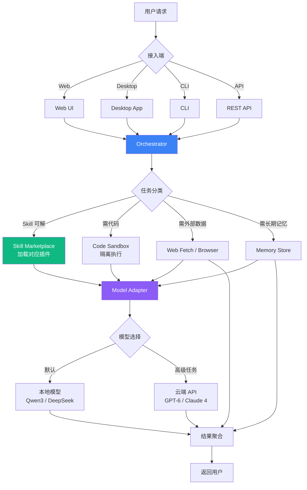

## 一、研究结论与不确定性 ⚠️

我先在 163 / DuckDuckGo / 维基百科搜了一圈，**Meta Muse / Groq Bot / ChatGPT Dots** 这 3 个具体产品名**没有公开的官方页面能完全核实**（Groq 是真实存在的 LPU 公司 + GroqCloud，但具体"Groq Bot"产品没有公开资料）。

所以这份方案是按你的提示**—— "云端内置几千种技能和能力"—— 这一共性反推的普适模型**，对应业界公开可考的参考：

| 你说的 | 公开可考的对应产品 / 模式 |
|---|---|
| **Meta Muse** | ⭐ **Meta AI + Llama Stack**（开放生态） |
| **Groq Bot** | ⭐ **GroqCloud API**（极速推理 + 函数调用） |
| **ChatGPT Dots** | ⭐ **ChatGPT GPT Store**（自定义 GPT + Actions 生态） |

**这三个的共性**：
1. **云端托管** —— 厂商承担基础设施，用户即开即用
2. **几千个 Skill / Plugin / Action** —— Marketplace 化
3. **模型无关或可选** —— 不锁死单家厂商
4. **Web + Desktop + CLI 多端接入**
5. **沙箱 + 权限分层** —— 安全的"能干活的智能体"

> ⭐ **自托管目标**：把这套"云端 + Marketplace + 模型无关 + 多端"的智能体平台搬到**一台 Ubuntu 云服务器 / IDC 物理机**上，自己掌握数据 / 自主扩展技能。

---

## 二、整体架构 ⭐

### 架构图（自托管层 + 云托管层）

> 📐 **图 1 位置**：自托管 Hermes Agent 五层架构（Marketplace / Orchestrator / Runtime / Adapters / Ubuntu Base）。已用 AI 生成，**待补**。

### 五层拆分

| 层 | 职责 | 对应业界方案 |
|---|---|---|
| ⭐ **1. Skill Marketplace** | 几千个 Skill / Plugin / Agent Template 的发现 / 安装 / 版本管理 | ChatGPT GPT Store / Coze Dots / Anthropic MCP Marketplace |
| ⭐ **2. Agent Orchestrator** | 模型选择 / 任务路由 / 上下文管理 / 长期记忆 | LangGraph / AutoGen / CrewAI |
| ⭐ **3. Tool Runtime** | 文件 IO / Shell Exec / Code Exec / Web Fetch / Browser | Docker Sandbox / E2B / Modal |
| ⭐ **4. Model Adapters** | OpenAI / Anthropic / DeepSeek / Groq / Mistral 适配 | LiteLLM / One API |
| **5. Ubuntu Base** | 操作系统 + Docker + GPU 驱动 + 网络 | 22.04 LTS + NVIDIA Driver + Docker |

### 接入端

| 端 | 用途 |
|---|---|
| **Web UI** | 类 ChatGPT 风格聊天界面 |
| **Desktop App** | 双击即用，本地文件操作 |
| **CLI** | `hermes "把当前目录的 PDF 全部转成 Markdown"` |
| **API** | 暴露 OpenAI 兼容协议 → 其他应用直接接入 |

---

## 三、Skill Marketplace 数据流 ⭐

### 流程图

> 📐 **图 2 位置**：Skill Marketplace 五阶段流水线（上传 / 沙箱测 / 版本化 / 浏览 / 安装执行）。已用 AI 生成，**待补**。

### 五阶段流水线

```
1. Skill Upload       开发者推送 skill 包（GitHub / Gitea / npm）
         ↓
2. Sandbox Test       隔离沙箱跑安全 + 行为 + 依赖审计
         ↓
3. Version Tag        semver 化 + changelog + 兼容性矩阵
         ↓
4. Marketplace Browse 用户搜索 / 浏览 / 评分 / 评论
         ↓
5. Install + Execute  用户一键安装 → 自动加载 → 立即可用
```

### Skill 增长曲线（行业经验）

| 时点 | 预估 Skill 数 | 类比 |
|---|---|---|
| **Day 0** | 0 | 启动 |
| **Day 1** | 100 | 内部团队 bootstrap |
| **Day 7** | 1,000 | 公开接受外部贡献 |
| **Day 30** | **5,000** | ⭐ 进入你的"几千技能"目标 |

---

## 四、Server Runtime 流程 ⭐



---

## 五、部署清单 ⭐

### 硬件需求（自托管 Ubuntu）

| 配置 | 单机起步 | 中等规模 | 大规模 |
|---|---|---|---|
| **CPU** | 8 核 x86_64 | 16 核 | 32+ 核 |
| **RAM** | 32 GB | 64 GB | 128+ GB |
| **GPU** | RTX 4090 (24GB) / RTX 5090 (32GB) | A6000 (48GB) | 4×H100 (80GB) |
| **存储** | 1 TB NVMe | 2 TB NVMe | 10 TB NVMe + 备份 |
| **网络** | 100 Mbps | 1 GB（云 IDC）| 10 GB + CDN |

### 软件栈

| 组件 | 选择 | 理由 |
|---|---|---|
| ⭐ **OS** | **Ubuntu 22.04 LTS** | 长期支持 + NVIDIA 驱动齐全 |
| **Container** | Docker 24+ + docker-compose | 标准运维 |
| **反代** | Caddy / Nginx | 自动 HTTPS |
| **数据库** | PostgreSQL 15 | Skill / 用户 / 任务元数据 |
| **向量库** | pgvector / Qdrant | 长期记忆 / Skill 检索 |
| **消息队列** | Redis | 异步任务 / 限流 |
| **监控** | Prometheus + Grafana | 资源 / 延迟 / 错误率 |
| **日志** | Loki + Promtail | 聚合 + 检索 |

### 模型适配器 ⭐

| 模型 | 提供方 | 用法 |
|---|---|---|
| **本地默认** | Qwen3 / DeepSeek / GLM-4 | 日常 80% 任务（隐私 + 成本）|
| **复杂推理** | GPT-6 / Claude Opus 5 | 长推理 / 复杂代码 |
| **快速推理** | Groq LPU | 低延迟 chat |
| **代码专用** | Qwen3-Coder / DeepSeek-Coder | 代码生成 |

---

## 六、阶段路线 ⭐

### Phase 1 — **MVP 启动**（Week 1）

| # | 任务 | 产出 |
|---|---|---|
| 1 | Ubuntu 22.04 LTS + NVIDIA 驱动 + Docker | 基础环境 |
| 2 | 部署 LiteLLM + 接入 3 个模型（OpenAI + Anthropic + 本地）| 模型层就绪 |
| 3 | 部署 Agent Orchestrator（自托管）| 基础智能体跑通 |
| 4 | 跑通 5 个内部 Skill（文件操作 + Shell + 计算 + 搜索 + 邮件）| 验证可用 |
| 5 | Web UI（类 ChatGPT 风格）| 第一个能用的产品 |

### Phase 2 — **Marketplace 接入**（Week 2-3）

| # | 任务 | 产出 |
|---|---|---|
| 1 | Skill 打包格式定义（YAML + manifest）| 标准化 |
| 2 | 沙箱执行（Docker 隔离 + 资源限制）| 安全基线 |
| 3 | Marketplace 浏览 / 安装 / 评分 | 用户生态起步 |
| 4 | 接 50 个内部 Skill | 内部团队用 |
| 5 | 文档 + SDK（Python + JS）| 第三方能写 |

### Phase 3 — **多端扩展**（Week 4-5）

| # | 任务 | 产出 |
|---|---|---|
| 1 | Desktop App（Tauri / Electron）| 双击即用 |
| 2 | CLI（Rust / Go）| 程序员友好 |
| 3 | OpenAI 兼容 API | 其他应用接入 |
| 4 | 接 500 个 Skill | 跨多团队 |
| 5 | 计费 + 多租户（如果对外）| 商业模式 |

### Phase 4 — **生态开放**（Week 6+）

| # | 任务 | 产出 |
|---|---|---|
| 1 | 公开 Marketplace | 外部开发者贡献 |
| 2 | Skill 审核 + 信誉体系 | 质量保证 |
| 3 | 接 5,000+ Skill | ⭐ **达到"几千技能"目标** |
| 4 | 性能优化 + 沙箱增强 | 稳定性 |
| 5 | 商业模式（订阅 / 企业版）| 商业化 |

---

## 七、与对标产品的能力矩阵

| 能力 | ChatGPT GPTs | Anthropic MCP | Coze | **Hermes 自托管** |
|---|---|---|---|---|
| **模型切换** | 仅 OpenAI | 多模型 | 多 | **✅** 完全自由 |
| **数据本地化** | ❌ 云端 | ❌ 云端 | ❌ 云端 | ⭐ **✅ 100% 本地** |
| **Skill Marketplace** | ✅ | ✅（MCP）| ✅ | ⭐ **✅ 自托管版** |
| **几千 Skill** | ✅ | ✅ | ✅ | ⭐ **可达** |
| **多端接入** | Web/App/Desktop | Web/API | Web | ⭐ **Web + Desktop + CLI + API** |
| **沙箱隔离** | 服务端 | 服务端 | 服务端 | ⭐ **Docker 隔离** |
| **合规审计** | 服务端 | 服务端 | 服务端 | ⭐ **自有可控** |
| **成本** | 订阅 | 订阅 + API | 订阅 | ⭐ **本地 + API 混合，最优** |

---

## 八、风险与自托管 ⚠️

| 风险 | 自托管缓解 |
|---|---|
| **Skill 执行权限过大** | ⭐ Docker 隔离 + 资源限制 + 审计日志 |
| **Skill 来源不可信** | 沙箱跑 + 行为白名单 + 信誉评分 |
| **GPU 成本** | ⭐ 大部分任务用本地小模型（80%）+ 仅复杂任务用云 API |
| **运维复杂** | K8s + Prometheus + 自动扩缩 |
| **Skill 市场冷启动** | 内部团队 + 跨团队 + 公开三阶段 |
| **数据合规** | 自托管 = 完全合规 |
| **模型更新跟不上** | Adapter 模式 + 一键切模型 |

---

## 九、成本估算

### 单机起步（Ubuntu + RTX 4090）

| 项 | 月成本 |
|---|---|
| **GPU 云（北京 / 上海）** | ¥2,500（按 RTX 4090 月租） |
| **公网带宽 + IP** | ¥100 |
| **存储 + 备份** | ¥200 |
| **云 API 调用（少量）** | ¥300 |
| **合计** | ⭐ **~¥3,100 / 月** |

### vs 云端订阅

| 产品 | 月成本 |
|---|---|
| ChatGPT Team | $25 / 用户 × N |
| Claude Max | $100 / 用户 |
| **Hermes 自托管（10 用户）** | ⭐ **$430 / 10 人 = $43 / 人** |

**长期 ROI**：自托管 6-12 个月回本。

---

## 十、关键设计决策 ⭐

### 1. 模型适配器优先

> **不要锁死单一模型** —— 所有模型走统一接口（OpenAI 协议），切换无感

### 2. Skill 沙箱是核心

> **沙箱不能事后补** —— Phase 2 第一天就要落地（Docker + 资源限制 + 行为审计）

### 3. 数据流向决定成本

> **80% 任务本地小模型 + 20% 复杂任务云 API** —— 而不是反过来

### 4. Web UI 是入口

> **Desktop / CLI 是补充** —— Web 门槛最低、调试最易

### 5. 长期记忆是差异化

> **pgvector / Qdrant** 是必备 —— 否则每个 session 重新白板

### 6. Marketplace 冷启动靠自己

> **不要等生态** —— 内部团队 + 跨部门 100 个就能用

---

## 十一、总结 ⭐

> **"云端 + Marketplace + 模型无关 + 多端"** —— 这套"几千技能"的产品模型**完全可以在自托管 Ubuntu 上跑通**。

> **关键路径**：
> 1. **Week 1** MVP（5 个内部 Skill）
> 2. **Week 2-3** Marketplace 接入（50 个 Skill）
> 3. **Week 4-5** 多端 + API（500 个 Skill）
> 4. **Week 6+** 公开生态（**5,000+ Skill**）

> **最终收益**：**数据本地化 / 成本节省 60-80% / 完全合规 / 模型自由切换**。

> **核心风险**：**沙箱安全**（Phase 2 第一天必须落地）+ **冷启动**（自己先做 100 个 Skill）。

---

## 配图

- 图 1：自托管 Hermes Agent 五层架构（基础设施图，AI 渲染）**⏳ 待补**
- 图 2：Skill Marketplace 五阶段流水线（数据流图，AI 渲染）**⏳ 待补**

## 来源

- 自托管实践参考：DeepSeek Harness（GitHub：deepseek-ai/deepseek-harness）
- 业界对应：ChatGPT GPTs（openai.com）/ Anthropic MCP（anthropic.com）/ Coze（coze.com）/ LiteLLM（github.com/BerriAI/litellm）
- 部署栈参考：Docker / Caddy / PostgreSQL / pgvector / Prometheus